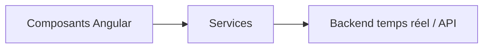

# Architecture — chatApp

## Objectif

Application **Angular** de **chat** (souvent couplée à **Firebase** pour auth / temps réel selon la configuration du projet).

## Structure

| Élément | Rôle |
|---------|------|
| Composants | Salles de chat, messages, utilisateur |
| Services | Envoi / réception de messages, état |
| Environnement | Clés et endpoints (ne pas committer de secrets) |

## Principes

- **Séparation** des composants « liste » / « saisie » / « entête ».
- **Observables** RxJS pour les flux asynchrones.

## Configuration

- Vérifier `environment.ts` / `environment.prod.ts` et les règles Firebase (si utilisées) avant déploiement.
